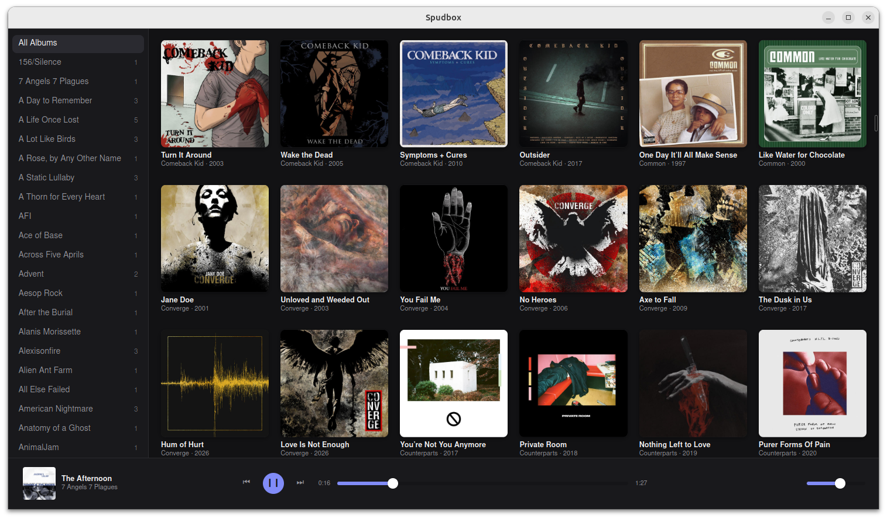
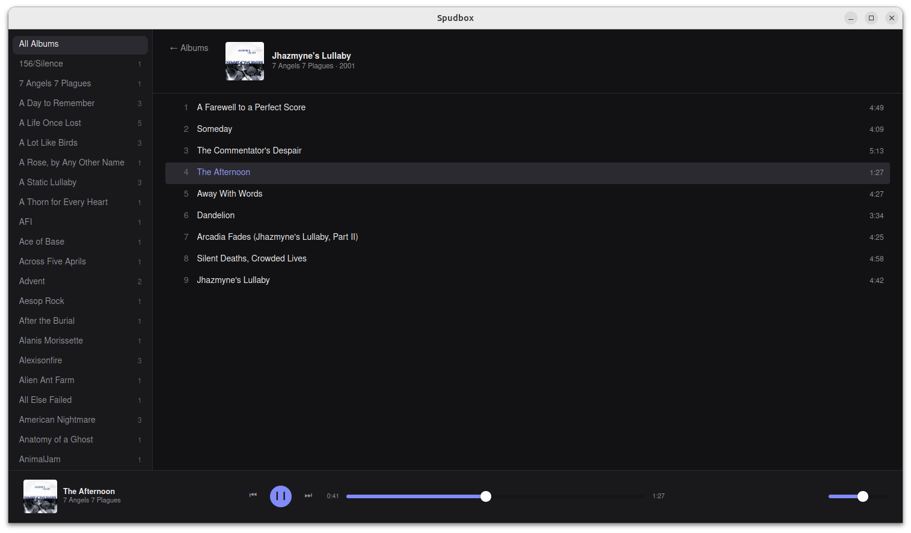

# Spudbox

A custom music player for Linux, built as a nicer alternative to Clementine: library browsing with album art, hi-res FLAC/MP3/AAC/WAV playback, gapless transitions, and MPRIS integration for system media controls. Built with Tauri v2, Rust, and Svelte.

<p align="center">
  
  
</p>

## Features

- Library scanning with incremental rescans (skips unchanged files), automatic on launch
- Browse by artist/album with a virtualized, art-forward grid and track list
- Hi-res playback (24-bit/96kHz+ FLAC and beyond) via a pure-Rust audio stack (`symphonia` + `rodio`/`cpal`) — no GStreamer dependency
- Gapless playback between queued tracks
- Album art extraction (embedded or folder cover images), cached as thumbnails
- MPRIS integration (system media keys, GNOME/KDE media widgets)
- Play history and stats tracked for future "recently played"/"most played" views
- Remembers volume and resumes the last queue/track (paused) on next launch

## Prerequisites (Linux)

- Rust (via [rustup](https://rustup.rs))
- Node.js + npm
- System packages: `libwebkit2gtk-4.1-dev`, `libasound2-dev`, plus the usual Tauri Linux build prerequisites ([full list](https://tauri.app/start/prerequisites/))

## Development

```
npm install
npm run tauri dev
```

## Building an installable package

```
npm run tauri build -- --bundles deb,appimage
```

Produces a `.deb` (Debian/Ubuntu) and a portable `.AppImage` (any modern Linux distro) under `src-tauri/target/release/bundle/`.

## Recommended IDE Setup

[VS Code](https://code.visualstudio.com/) + [Svelte](https://marketplace.visualstudio.com/items?itemName=svelte.svelte-vscode) + [Tauri](https://marketplace.visualstudio.com/items?itemName=tauri-apps.tauri-vscode) + [rust-analyzer](https://marketplace.visualstudio.com/items?itemName=rust-lang.rust-analyzer).
